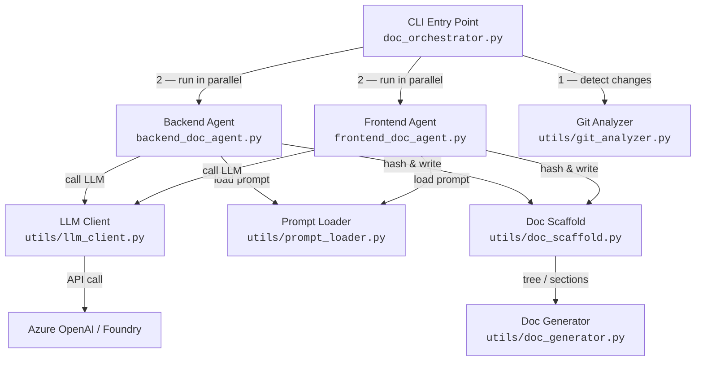
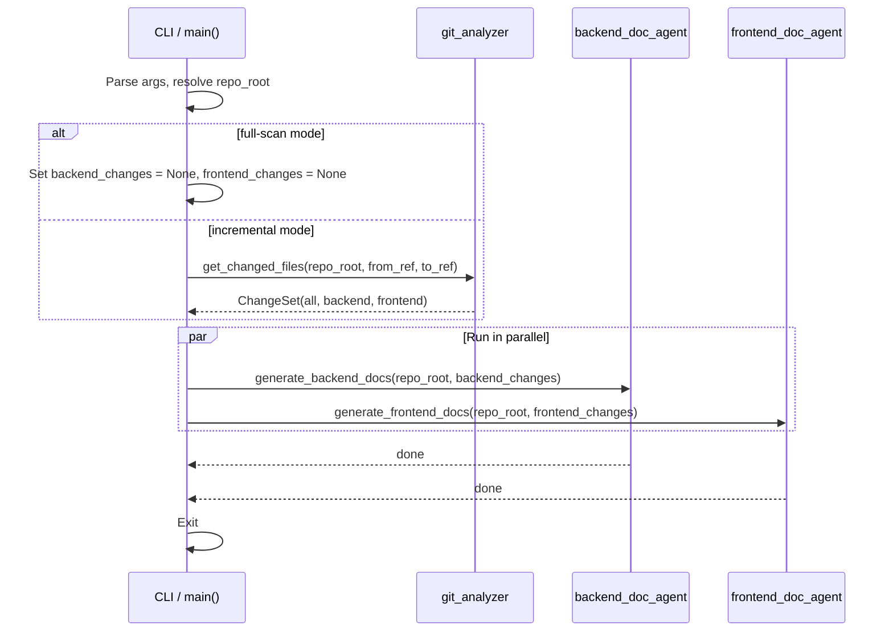
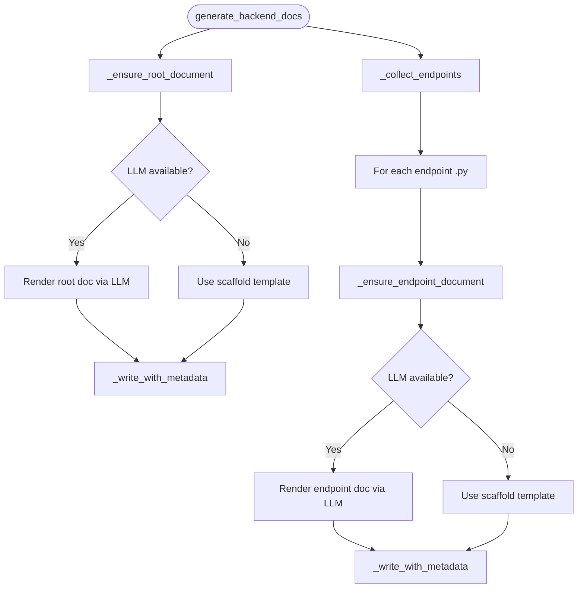
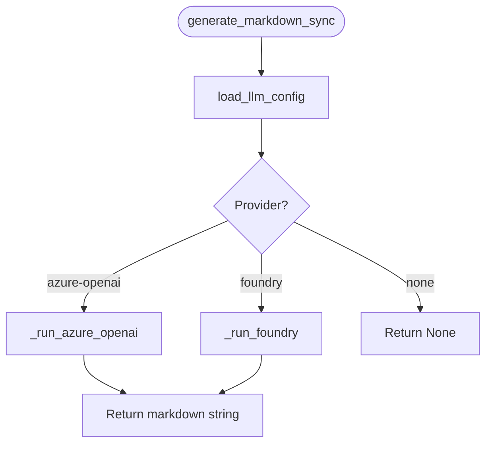

# Documentation Agents

Automated documentation generation system that scans the repository and produces
Markdown documents for the **backend** (API endpoints) and **frontend** (feature
directories).  Documents are regenerated only when source files change (tracked
via content hashes stored in `_doc_metadata.json` sidecars).

---

## Table of Contents

1. [Architecture Overview](#architecture-overview)
2. [Execution Flow](#execution-flow)
3. [File Reference](#file-reference)
4. [LLM Provider Configuration](#llm-provider-configuration)
5. [Logging](#logging)
6. [CLI Usage](#cli-usage)

---

## Architecture Overview



---

## Execution Flow

### 1. Orchestrator (`doc_orchestrator.py`)



### 2. Backend Agent (`backend_doc_agent.py`)



**Key steps inside `_write_with_metadata`:**

1. Call `should_regenerate()` — compare stored source hash with current hash.
2. If unchanged → skip.
3. Otherwise → write doc, persist `_doc_metadata.json`.

### 3. Frontend Agent (`frontend_doc_agent.py`)

Mirrors the backend agent pattern but scans `frontend/src/features/*` directories
instead of `backend/api/v1/endpoints/*.py`.


### 4. LLM Client (`utils/llm_client.py`)



**Config resolution priority:**

| Variable checked          | Purpose              |
|---------------------------|----------------------|
| `DOC_LLM_PROVIDER`       | Explicit provider    |
| `AZURE_OPENAI_URL`       | Azure endpoint       |
| `AZURE_OPENAI_KEY`       | Azure API key        |
| `AZURE_GPT_API`          | API version          |
| `DOC_LLM_MODEL`          | Model deployment     |
| `FOUNDRY_PROJECT_ENDPOINT` | Foundry endpoint   |
| `FOUNDRY_MODEL_DEPLOYMENT` | Foundry deployment |

---

## File Reference

```
backend/documentation_agent/
├── __init__.py               # Package marker
├── doc_orchestrator.py       # CLI entry point & parallel runner
├── backend_doc_agent.py      # Backend doc generation logic
├── frontend_doc_agent.py     # Frontend doc generation logic
├── DOCUMENTATION.md          # This file
├── prompts/
│   ├── backend_endpoint.txt  # Prompt template for endpoint docs
│   ├── backend_root.txt      # Prompt template for backend root doc
│   ├── frontend_feature.txt  # Prompt template for feature docs
│   └── frontend_root.txt     # Prompt template for frontend root doc
└── utils/
    ├── __init__.py            # Re-exports all utility symbols
    ├── doc_generator.py       # Markdown generation helpers (tree, sections)
    ├── doc_scaffold.py        # Hash tracking, metadata, scaffold templates
    ├── git_analyzer.py        # Git diff detection & categorisation
    ├── llm_client.py          # Azure OpenAI / Foundry LLM calls
    └── prompt_loader.py       # Load prompt templates from disk
```

---

## LLM Provider Configuration

The system reads configuration from the `.env` file located inside `backend/`.

### Azure OpenAI (default)

```env
DOC_LLM_PROVIDER=azure-openai
DOC_LLM_MODEL=gpt-4.1                          # optional, defaults to gpt-4.1
AZURE_OPENAI_URL=https://<resource>.openai.azure.com/
AZURE_OPENAI_KEY=<your-key>
AZURE_GPT_API=2024-12-01-preview               # optional
```

### Azure Foundry

```env
DOC_LLM_PROVIDER=foundry
FOUNDRY_PROJECT_ENDPOINT=https://<endpoint>
FOUNDRY_MODEL_DEPLOYMENT=<deployment-name>
```

> If `DOC_LLM_PROVIDER` is not set, the system auto-detects based on which
> environment variables are present.

### Fallback Behaviour

When no LLM configuration is found (or the API call fails), agents fall back
to **scaffold templates** that produce a skeleton Markdown file with placeholder
sections. These can be filled in manually later.

---

## Logging

All modules use Python's `logging` module with prefixed tags for easy filtering:

| Prefix              | Source file              |
|---------------------|--------------------------|
| `[orchestrator]`    | `doc_orchestrator.py`    |
| `[backend_agent]`   | `backend_doc_agent.py`   |
| `[frontend_agent]`  | `frontend_doc_agent.py`  |
| `[llm_client]`      | `utils/llm_client.py`    |
| `[scaffold]`        | `utils/doc_scaffold.py`  |
| `[git_analyzer]`    | `utils/git_analyzer.py`  |
| `[prompt_loader]`   | `utils/prompt_loader.py` |

The orchestrator configures logging at `INFO` level by default. Set
`DEBUG` for verbose output (prompt lengths, hash comparisons, git commands):

```python
logging.basicConfig(level=logging.DEBUG)
```

---

## CLI Usage

Run from the **repository root**:

```bash
# Full scan — regenerate all docs
python backend/documentation_agent/doc_orchestrator.py --repo-root . --full-scan

# Incremental — only changed files between two refs
python backend/documentation_agent/doc_orchestrator.py --repo-root . --from-ref HEAD~3 --to-ref HEAD
```

### Arguments

| Flag           | Default   | Description                                      |
|----------------|-----------|--------------------------------------------------|
| `--repo-root`  | `.`       | Path to the repository root                      |
| `--from-ref`   | `HEAD~1`  | Git ref to diff from (incremental mode)          |
| `--to-ref`     | `HEAD`    | Git ref to diff to                               |
| `--full-scan`  | `false`   | Regenerate all docs regardless of changes        |

### Output

Each agent writes a `documentation.md` alongside the source it documents,
plus a `_doc_metadata.json` sidecar for change tracking:

```
backend/
├── documentation.md            ← backend root doc
├── _doc_metadata.json
└── api/v1/endpoints/
    ├── reports/
    │   ├── documentation.md    ← endpoint doc
    │   └── _doc_metadata.json
    └── orders/
        ├── documentation.md
        └── _doc_metadata.json

frontend/
├── documentation.md            ← frontend root doc
├── _doc_metadata.json
└── src/features/
    ├── editor/
    │   ├── documentation.md    ← feature doc
    │   └── _doc_metadata.json
    └── landing/
        ├── documentation.md
        └── _doc_metadata.json
```
