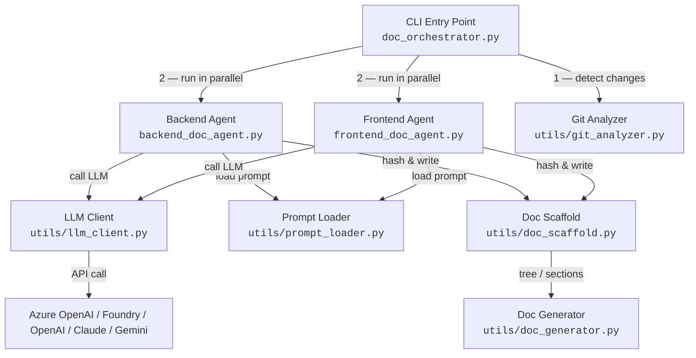
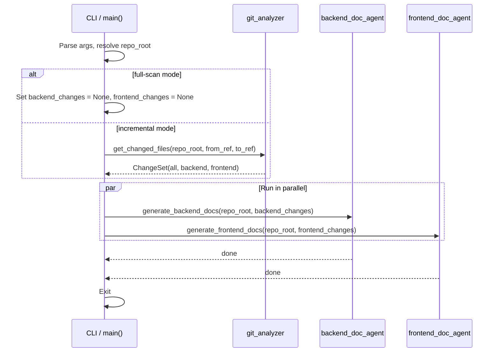
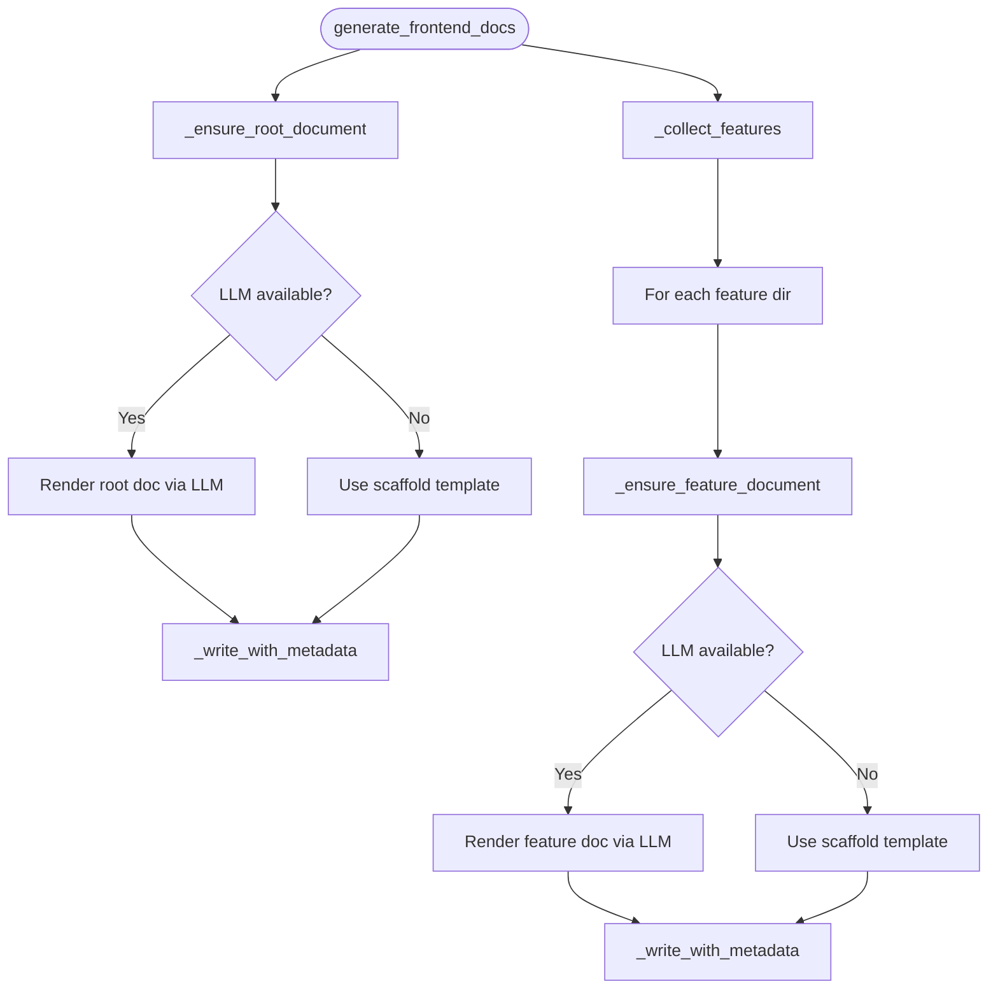
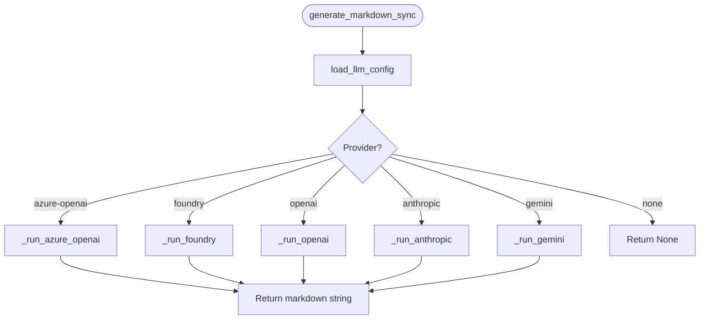

# Documentation Agents

Automated documentation generation system that scans the repository and produces
Markdown documents for the **backend** (API endpoints) and **frontend** (feature
directories).  Documents are regenerated only when source files change (tracked
via content hashes stored in `_doc_metadata.json` sidecars).

---

## Table of Contents

1. [Architecture Overview](#architecture-overview)
2. [Execution Flow](#execution-flow)
3. [File Reference](#file-reference)
4. [Setup & Dependencies](#setup--dependencies)
5. [LLM Provider Configuration](#llm-provider-configuration)
6. [Personal GitHub Push (without office remote)](#personal-github-push-without-office-remote)
7. [Logging](#logging)
8. [CLI Usage](#cli-usage)

---

## Architecture Overview



---

## Execution Flow

### 1. Orchestrator (`doc_orchestrator.py`)



### 2. Backend Agent (`backend_doc_agent.py`)


**Key steps inside `_write_with_metadata`:**

1. Call `should_regenerate()` — compare stored source hash with current hash.
2. If unchanged → skip.
3. Otherwise → write doc, persist `_doc_metadata.json`.

### 3. Frontend Agent (`frontend_doc_agent.py`)

Mirrors the backend agent pattern but scans `frontend/src/features/*` directories
instead of `backend/api/v1/endpoints/*.py`.



### 4. LLM Client (`utils/llm_client.py`)



**Config resolution priority:**

| Variable checked             | Purpose                         |
|-----------------------------|---------------------------------|
| `DOC_LLM_PROVIDER`          | Explicit provider selection     |
| `FOUNDRY_PROJECT_ENDPOINT`  | Foundry endpoint                |
| `FOUNDRY_MODEL_DEPLOYMENT`  | Foundry model deployment        |
| `AZURE_OPENAI_URL`          | Azure OpenAI endpoint           |
| `AZURE_OPENAI_KEY`          | Azure OpenAI API key            |
| `AZURE_GPT_API`             | Azure OpenAI API version        |
| `AZURE_OPENAI_MODEL`        | Azure model (or `DOC_LLM_MODEL`)|
| `OPENAI_API_KEY`            | OpenAI API key (ChatGPT)        |
| `OPENAI_MODEL`              | OpenAI model (or `DOC_LLM_MODEL`)|
| `ANTHROPIC_API_KEY`         | Anthropic API key (Claude)      |
| `ANTHROPIC_MODEL`           | Claude model (or `DOC_LLM_MODEL`)|
| `GEMINI_API_KEY`            | Google Gemini API key           |
| `GOOGLE_API_KEY`            | Alternate Gemini API key name   |
| `GEMINI_MODEL`              | Gemini model (or `DOC_LLM_MODEL`)|

---

## File Reference

```
backend/documentation_agent/
├── __init__.py               # Package marker
├── doc_orchestrator.py       # CLI entry point & parallel runner
├── backend_doc_agent.py      # Backend doc generation logic
├── frontend_doc_agent.py     # Frontend doc generation logic
├── DOCUMENTATION.md          # This file
├── prompts/
│   ├── backend_endpoint.txt  # Prompt template for endpoint docs
│   ├── backend_root.txt      # Prompt template for backend root doc
│   ├── frontend_feature.txt  # Prompt template for feature docs
│   └── frontend_root.txt     # Prompt template for frontend root doc
└── utils/
    ├── __init__.py            # Re-exports all utility symbols
    ├── doc_generator.py       # Markdown generation helpers (tree, sections)
    ├── doc_scaffold.py        # Hash tracking, metadata, scaffold templates
    ├── git_analyzer.py        # Git diff detection & categorisation
    ├── llm_client.py          # Multi-provider LLM calls (Azure/OpenAI/Claude/Gemini)
    └── prompt_loader.py       # Load prompt templates from disk
```

---

## Setup & Dependencies

The documentation agent can run with or without an LLM provider.

### 1) Install required libraries

From the repository root:

```bash
python -m venv .venv
.venv\Scripts\activate
pip install -r backend/documentation_agent/requirements-docs.txt
```

`requirements-docs.txt` includes provider SDKs for:

- Azure Foundry (`agent-framework-azure-ai`, `azure-identity`)
- Azure OpenAI / OpenAI (`openai`)
- Claude (`anthropic`)
- Gemini (`google-genai`)
- `.env` loading (`python-dotenv`)

### 2) Create local environment file

Create or update `backend/.env` and set **one** provider block at a time.

Quick start:

```bash
cp backend/.env.example backend/.env
```

On Windows PowerShell:

```powershell
Copy-Item backend/.env.example backend/.env
```

---

## LLM Provider Configuration

The system reads configuration from `backend/.env` (fallback: repo-level `.env`).

### Provider selector

```env
DOC_LLM_PROVIDER=azure-openai   # or: foundry | openai | anthropic | gemini
```

Accepted aliases:

- `chatgpt` → `openai`
- `claude` → `anthropic`
- `azure` → `azure-openai`
- `google` → `gemini`

### Azure OpenAI

```env
DOC_LLM_PROVIDER=azure-openai
AZURE_OPENAI_URL=https://<resource>.openai.azure.com/
AZURE_OPENAI_KEY=<your-azure-openai-key>
AZURE_GPT_API=2024-12-01-preview        # optional
AZURE_OPENAI_MODEL=gpt-4.1              # optional (or use DOC_LLM_MODEL)
```

### Azure Foundry

```env
DOC_LLM_PROVIDER=foundry
FOUNDRY_PROJECT_ENDPOINT=https://<your-foundry-project-endpoint>
FOUNDRY_MODEL_DEPLOYMENT=<deployment-name>
```

### OpenAI (ChatGPT)

```env
DOC_LLM_PROVIDER=openai
OPENAI_API_KEY=<your-openai-api-key>
OPENAI_MODEL=gpt-4.1                     # optional (or use DOC_LLM_MODEL)
```

### Anthropic (Claude)

```env
DOC_LLM_PROVIDER=anthropic
ANTHROPIC_API_KEY=<your-anthropic-api-key>
ANTHROPIC_MODEL=claude-3-7-sonnet-latest # optional (or use DOC_LLM_MODEL)
```

### Google Gemini

```env
DOC_LLM_PROVIDER=gemini
GEMINI_API_KEY=<your-gemini-api-key>     # or GOOGLE_API_KEY
GEMINI_MODEL=gemini-2.0-flash            # optional (or use DOC_LLM_MODEL)
```

### Auto-detection behavior

If `DOC_LLM_PROVIDER` is omitted, provider is auto-detected in this order:

1. Foundry
2. Azure OpenAI
3. OpenAI
4. Anthropic
5. Gemini

### Fallback behaviour

If no valid provider config exists (or provider call fails), the agents fall
back to scaffold templates and still generate structured placeholder docs.

---

## Personal GitHub Push (without office remote)

Use a separate remote for your personal account, then push to that remote only.

### Option A: Keep office remote, add personal remote

```bash
git remote -v
git remote add personal https://github.com/<your-username>/brcgs-ui.git
git push -u personal <your-branch>
```

### Option B: Replace `origin` with personal repo

```bash
git remote -v
git remote rename origin office
git remote add origin https://github.com/<your-username>/brcgs-ui.git
git push -u origin <your-branch>
```

### Verify before pushing

```bash
git remote -v
```

Make sure the remote you are pushing to points to your personal GitHub URL.

---

## Logging

All modules use Python's `logging` module with prefixed tags for easy filtering:

| Prefix              | Source file              |
|---------------------|--------------------------|
| `[orchestrator]`    | `doc_orchestrator.py`    |
| `[backend_agent]`   | `backend_doc_agent.py`   |
| `[frontend_agent]`  | `frontend_doc_agent.py`  |
| `[llm_client]`      | `utils/llm_client.py`    |
| `[scaffold]`        | `utils/doc_scaffold.py`  |
| `[git_analyzer]`    | `utils/git_analyzer.py`  |
| `[prompt_loader]`   | `utils/prompt_loader.py` |

The orchestrator configures logging at `INFO` level by default. Set
`DEBUG` for verbose output (prompt lengths, hash comparisons, git commands):

```python
logging.basicConfig(level=logging.DEBUG)
```

---

## CLI Usage

Run from the **repository root**:

```bash
# Full scan — regenerate all docs
python backend/documentation_agent/doc_orchestrator.py --repo-root . --full-scan

# Incremental — only changed files between two refs
python backend/documentation_agent/doc_orchestrator.py --repo-root . --from-ref HEAD~3 --to-ref HEAD
```

### Arguments

| Flag           | Default   | Description                                      |
|----------------|-----------|--------------------------------------------------|
| `--repo-root`  | `.`       | Path to the repository root                      |
| `--from-ref`   | `HEAD~1`  | Git ref to diff from (incremental mode)          |
| `--to-ref`     | `HEAD`    | Git ref to diff to                               |
| `--full-scan`  | `false`   | Regenerate all docs regardless of changes        |

### Output

Each agent writes a `documentation.md` alongside the source it documents,
plus a `_doc_metadata.json` sidecar for change tracking:

```
backend/
├── documentation.md            ← backend root doc
├── _doc_metadata.json
└── api/v1/endpoints/
    ├── reports/
    │   ├── documentation.md    ← endpoint doc
    │   └── _doc_metadata.json
    └── orders/
        ├── documentation.md
        └── _doc_metadata.json

frontend/
├── documentation.md            ← frontend root doc
├── _doc_metadata.json
└── src/features/
    ├── editor/
    │   ├── documentation.md    ← feature doc
    │   └── _doc_metadata.json
    └── landing/
        ├── documentation.md
        └── _doc_metadata.json
```
